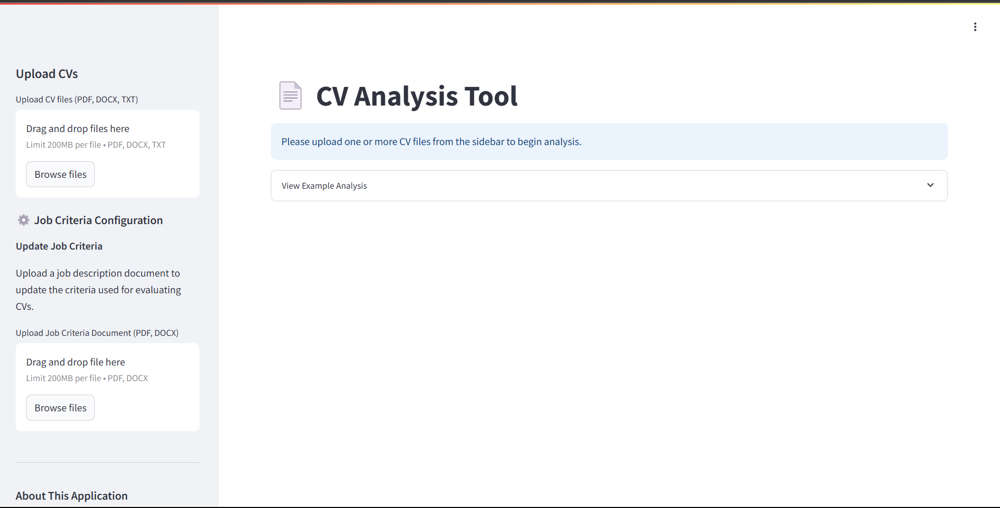

# CV Analysis Tool

A Streamlit-based application that analyzes multiple CV/resume documents using a sophisticated AI model, providing detailed feedback and comparison tools for recruitment processes.



## Overview

The CV Analysis Tool interfaces with an Azure-hosted FastAgent API and Azure OpenAI to help recruiters and hiring managers efficiently evaluate multiple candidate CVs against job requirements. The application provides a user-friendly interface for uploading documents and reviewing analysis results with visual comparisons and AI-powered insights.

### Key Features

- **Multi-CV Upload**: Support for PDF, DOCX, and TXT file formats
- **AI-Powered Analysis**: Detailed evaluation using a sophisticated AI analysis engine
- **Structured Response Format**: Clearly organized analysis with scorecards and evaluation metrics
- **Individual Analysis**: Comprehensive breakdown of each CV against predefined criteria
- **Match Scoring**: Numerical scoring system showing how well each candidate matches requirements
- **Automatic Comparative Summary**: AI-generated comparison of all candidates using Azure OpenAI GPT-4o mini
- **Feedback System**: Rate the quality of analysis to improve future results
- **Export Functionality**: Download analysis results in CSV format
- **Reset Capability**: Clear results and analyze new CVs without restarting

## Getting Started

### Prerequisites

- Python 3.8+
- Azure FastAPI endpoint credentials (username and password)
- Azure OpenAI API access with GPT-4o mini deployment

### Installation

1. **Clone the repository**

   ```bash
   git clone https://github.com/yourusername/cv-analysis-tool.git
   cd cv-analysis-tool
   ```

2. **Create and configure the environment file**

   Create a `.env` file in the root directory with the following content:

   ```
   API_USERNAME=your_username_here
   API_PASSWORD=your_password_here
   API_BASE_URL=https://hr-demo-app.ambitiousriver-e696f55c.australiaeast.azurecontainerapps.io/api/v1
   REVISION_ID=5ccc4a42-1e24-4b82-a550-e7e9c6ffa48b
   AZURE_BLOB_STORAGE_URL=https://storageaccount.blob.core.windows.net/container/blob?sastoken
   AZURE_OPENAI_ENDPOINT=https://your-resource-name.openai.azure.com
   AZURE_OPENAI_KEY=your_api_key_here
   AZURE_OPENAI_DEPLOYMENT_NAME=gpt-4o-mini
   ```

   Replace placeholder values with your actual API credentials.

3. **Install Python dependencies**

   ```bash
   # Create and activate a virtual environment (recommended)
   python -m venv .venv
   source .venv/bin/activate  # On Windows: .venv\Scripts\activate

   # Install required packages
   pip install -r requirements.txt
   ```

4. **Run the application**

   ```bash
   streamlit run app.py
   ```

   Or use the provided startup scripts:

   ```bash
   # On Linux/macOS
   chmod +x start_app.sh
   ./start_app.sh

   # On Windows
   start_app.bat
   ```

5. **Access the application**

   Open your browser and navigate to `http://localhost:8501`

## How to Use

1. **Upload CVs**: Use the sidebar to upload one or more CV files (PDF, DOCX, or TXT)
2. **Run Analysis**: Click the "Analyze CVs" button to process all documents
3. **Review Results**:
   - Navigate between individual tabs to see detailed analysis for each CV
   - View structured analysis reports with scorecards and evaluations
   - Each CV analysis includes position fit assessment, qualification scores, and detailed feedback
   - See the "Comparative Summary" tab for an AI-generated comparison of all candidates
   - Review the automatically generated insights highlighting strongest candidates and key comparisons
   - Provide feedback using the thumbs up/down buttons for individual analyses
4. **Export Data**: Download results as CSV for further processing or sharing
5. **Reset and Restart**: Use the "Clear Results" button to analyze a new set of CVs

## Analysis Structure

Each CV analysis includes:

- **Analysis**: Concise summary of the candidate's suitability for the position
- **Scorecard**: Table showing position requirements versus candidate qualifications with numerical scores (out of 10)
- **Overall Evaluation**: Comprehensive assessment of the candidate's fit
- **Evaluation Report**: Structured review with detailed sections:
  - Overall Summary
  - Detailed Evaluation (with categorized points)
  - Criteria Scoring (using 1-5 scale)
  - Recommendation

The **Comparative Summary** tab provides:

- Side-by-side comparison of all candidates
- Highlighted strengths and weaknesses across candidates
- Ranking of candidates based on overall suitability
- Key differentiating factors between candidates

## Project Structure

- **app.py**: Main Streamlit application file containing the UI and API integration logic
- **config.py**: Configuration settings and environment variable handling
- **services/**: Directory containing API clients and service integrations
  - **api_client.py**: FastAgent API client for CV analysis
  - **openai_client.py**: Azure OpenAI client for comparative summaries
  - **blob_storage.py**: Azure Blob storage client
  - **text_extraction.py**: Document text extraction utilities
- **ui/**: Directory containing UI components and pages
  - **main_page.py**: Main page UI logic and results display
  - **sidebar.py**: Sidebar UI components and interactions
  - **components.py**: Reusable UI components
- **utils/**: Directory containing utility functions
- **start_app.sh/start_app.bat**: Startup scripts for Linux/macOS and Windows

## API Integration

The application integrates with two main API services:

1. **FastAgent API**: Analyzes individual CVs against job requirements

   - `POST /api/v1/chat`: Submit CVs for analysis (Basic authentication required)
   - `PUT /api/v1/messages/{message_id}/feedback`: Submit feedback on analysis quality

2. **Azure OpenAI API**: Generates comparative summaries of all candidates
   - Uses the GPT-4o mini model to compare multiple CV analyses
   - Produces comprehensive candidate comparisons and recommendations

## Configuration

- **FastAgent API**: Configure API endpoint, username, and password in the `.env` file
- **Azure OpenAI**: Set your endpoint, API key, and deployment name in the `.env` file
- **Azure Blob Storage**: Configure blob storage URL with SAS token for job criteria updates

## Important Notes

- The comparative summary feature requires valid Azure OpenAI API credentials
- The app will automatically generate the summary when analyses are complete
- You can regenerate the comparative summary at any time with the "Regenerate Summary" button
- For best results, ensure all CVs are for positions with similar requirements
